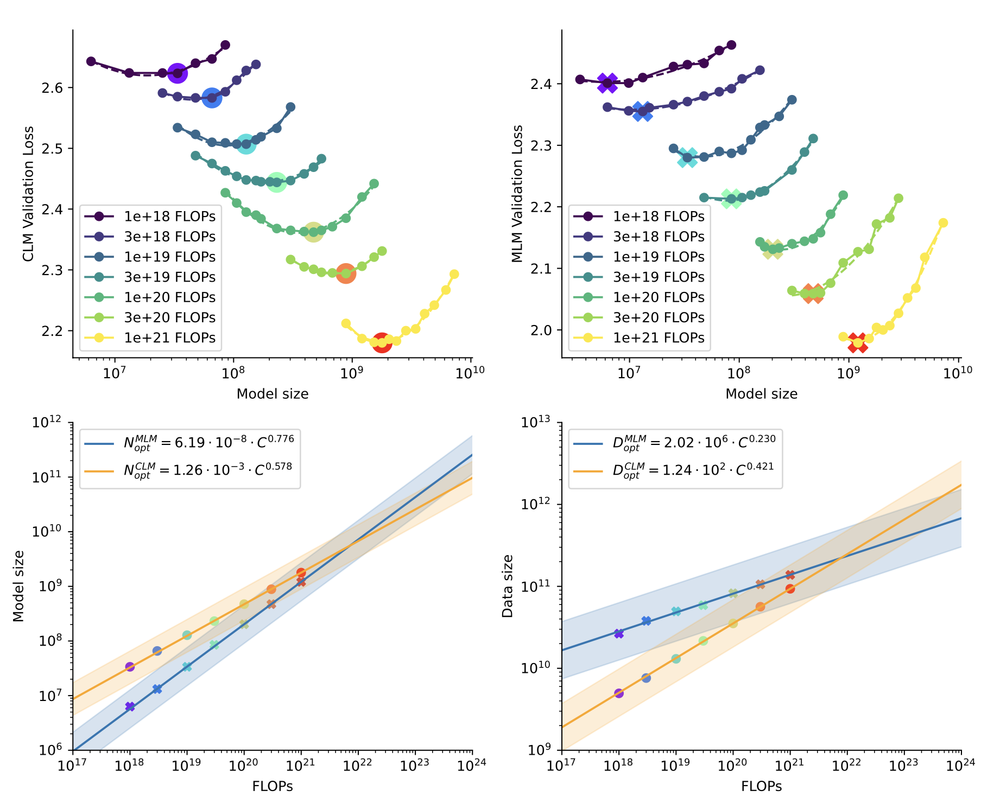

# Training Compute-Optimal Protein Language Models



We explore optimally training protein language models, an area of significant interest in biological research where guidance on best practices is limited. 
Most models are trained with extensive compute resources until performance gains plateau, focusing primarily on increasing model sizes rather than optimizing the
efficient compute frontier that balances performance and compute budgets. Our investigation is grounded in a massive dataset consisting of 939 million protein
sequences. 
We trained over 300 models ranging from 3.5 million to 10.7 billion parameters on 5 to 200 billion unique tokens, to investigate the relations between model sizes, training token numbers, and objectives. 
Based on our runs we propose and empirically validate a scaling law for compute optimality that accounts for the decreasing value of repeated tokens and excess parameters. We also experiment with approaches mitigating data scarcity, including augmenting the training dataset with code data, perplexity-filtering and deduplication. Models and datasets from our 400 training runs are available via this repository.
[Training Compute-Optimal Protein Language Models](https://www.biorxiv.org/content/10.1101/2024.06.06.597716v1.full.pdf) accepted by NeurIPS2024 as a spotlight paper.

# Data and Training Logs
We have created a validation set log that includes CLM (GPT), MLM (BERT), and all different model sizes for transfers between them. This log is also the main source for our scaling law data. Additionally, this directory contains the mask ratio and training logs for UR50, which are described in detail in the paper, focusing on ablation experiments for training data and mask ratio.

# Plots
The plot_examples directory contains two demo files in IPython Notebook format. The scaling_law_fit_example demonstrates the basic construction of a scaling law graph, and you can refer to the paper for specific details. Note that the figures generated by this code will be more raw and simple compared to those in the paper, as they have not been polished. The other file, UR50_UniMeta_learning_curve_example, shows the loss curve graph from Figure 1 of the paper. In the UR50 dataset, CLM/MLM experiences diminishing returns and overfitting.

# 7B CLM and 10B MLM
Following our scaling law, we found the optimal model size is 7B CLM when taking PROGEN-xlarge FLOPS budget, 10B MLM when using ESM2 (3B) FLOPs budget.
We release the 7B CLM and 10B MLM pre-training models, which can be downloaded from [xTrimoPGLM](https://huggingface.co/Bo1015) model hub.


# Parametric Fit
You can use our function to fit the expected loss given model size and training tokens as follows:

```python
def min_loss_by_flops(data):
    # Using dictionary comprehension and the min function
    return {flops: min(d[flops] for d in data.values() if flops in d) for flops in set().union(*data.values())}

def format_exponential(x, pos):
    """Custom formatting function, convert scale to 10^x form"""
    if x <= 0:
        return "N/A"
    exponent = int(np.log10(x))
    return f'$10^{exponent}$'

def linear_fit(x, a, b):
    return a * x + b

def chinchilla_fit(N_and_D, E, A, B, alpha, beta):
    N, D = N_and_D
    return E + A / (N ** alpha) + B / (D ** beta)

def exponential_fit(x, a, b):
    return a * np.power(x, b)
def exponential_inverse_fit(x, a, b):
    return np.power(a/x ,b)

def fit_inverse_exp_curve(x, y, is_ND=True):
    pfs = 8.64e+19
    if is_ND:
        params, covariance = curve_fit(exponential_fit, 1.0/np.array(x), y, maxfev=100000)
    else:
        params, covariance = curve_fit(exponential_fit, 1.0/(np.array(x)/pfs), y, maxfev=100000)
    return params

def fit_exp_curve(x, y, is_ND=True):
    pfs = 8.64e+19
    if is_ND:
        params, covariance = curve_fit(exponential_fit, np.array(x), y, maxfev=10000)
    else:
        params, covariance = curve_fit(exponential_fit, np.array(x)/pfs, y, maxfev=10000)
    return params 

def fit_chinchilla_curve(N, D, L_hat, p0):
    N_and_D = (N,D)
    params, cov = curve_fit(chinchilla_fit, N_and_D, L_hat, p0, maxfev=12000, method='trf')
    return params
    
def fit_linear_curve(x,y, is_ND=True):

    if is_ND:
        params, cov = curve_fit(linear_fit, np.log10(x), np.log10(y))
    else:
        params, cov = curve_fit(linear_fit, np.log10(x), y)
    return params

```

# Citation
```bibtex
@article{chen2024xtrimopglm,
  title={xTrimoPGLM: unified 100B-scale pre-trained transformer for deciphering the language of protein},
  author={Chen, Bo and Cheng, Xingyi and Li, Pan and Geng, Yangli-ao and Gong, Jing and Li, Shen and Bei, Zhilei and Tan, Xu and Wang, Boyan and Zeng, Xin and others},
  journal={arXiv preprint arXiv:2401.06199},
  year={2024}
}
@article{cheng2024training,
  title={Training Compute-Optimal Protein Language Models},
  author={Cheng, Xingyi and Chen, Bo and Li, Pan and Gong, Jing and Tang, Jie and Song, Le},
  journal={bioRxiv},
  pages={2024--06},
  year={2024},
  publisher={Cold Spring Harbor Laboratory}
}
```


